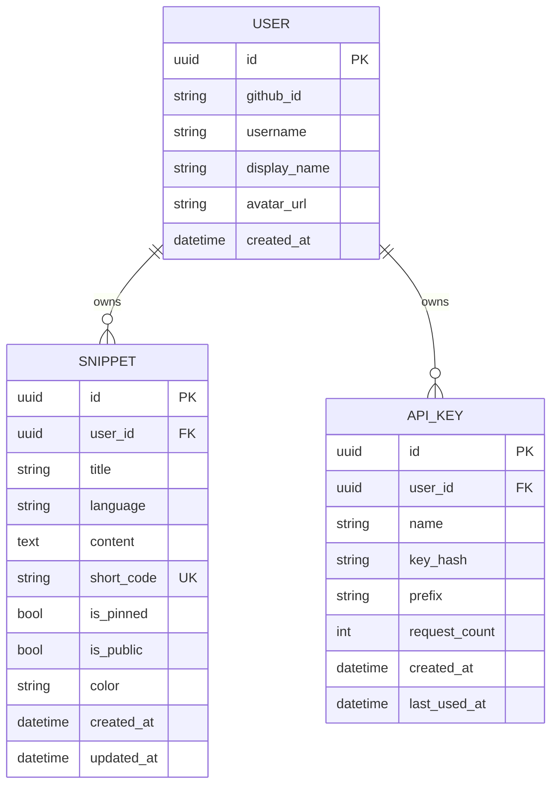
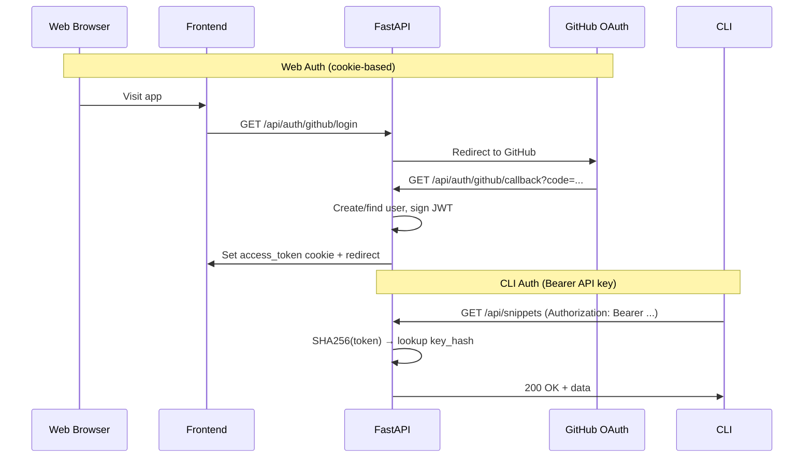
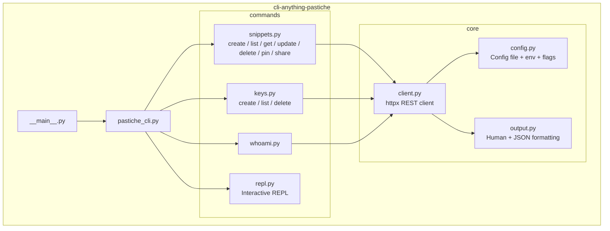

# Pastiche Architecture

Pastiche is a code snippets platform with a FastAPI backend, PostgreSQL database, and React/TypeScript frontend.

## System Overview

```mermaid
graph TB
    subgraph "Frontend"
        FE[React + Vite + TypeScript]
    end

    subgraph "CLI"
        CLI[cli-anything-pastiche<br/>Click CLI + httpx]
    end

    subgraph "Backend API"
        API[FastAPI + Uvicorn]
        AUTH[Auth Layer<br/>JWT cookie + Bearer API key]
        SNIP[Snippets Router<br/>CRUD + pin + visibility + search]
        KEYS[API Keys Router]
        PUB[Public Router]
        HEALTH[Health Router]
    end

    subgraph "Services"
        S_SNIP[SnippetService]
        S_KEY[ApiKeyService]
        S_USER[UserService]
    end

    subgraph "Data"
        DB[(PostgreSQL)]
        ALEMBIC[Alembic Migrations]
    end

    FE -->|HTTPS /api/*| API
    CLI -->|HTTPS /api/* + Bearer| API
    API --> AUTH
    API --> SNIP
    API --> KEYS
    API --> PUB
    API --> HEALTH
    SNIP --> S_SNIP
    KEYS --> S_KEY
    AUTH --> S_USER
    S_SNIP --> DB
    S_KEY --> DB
    S_USER --> DB
    ALEMBIC --> DB
```

## API Routes

```mermaid
graph LR
    subgraph "/api"
        subgraph "/auth"
            A_LOGIN[GET /auth/github/login]
            A_CALLBACK[GET /auth/github/callback]
            A_ME[GET /auth/me]
            A_LOGOUT[POST /auth/logout]
        end

        subgraph "/snippets"
            S_CREATE[POST /]
            S_LIST[GET /]
            S_GET[GET /{id}]
            S_UPDATE[PATCH /{id}]
            S_DELETE[DELETE /{id}]
            S_PIN[PATCH /{id}/pin]
            S_VIS[PATCH /{id}/visibility]
            S_SHORT[GET /resolve/{code}]
        end

        subgraph "/keys"
            K_CREATE[POST /]
            K_LIST[GET /]
            K_DELETE[DELETE /{id}]
        end

        subgraph "/s"
            P_VIEW[GET /{code}]
        end

        H_HEALTH[GET /api/health]
    end
```

## Data Model



## Auth Flow



## CLI Architecture



## CLI Runtime Notes

- Package location: `cli/agent-harness/`
- Entry points: `cli-anything-pastiche` and `python -m cli_anything.pastiche`
- Root command loads config once, stores shared context, and drops into the REPL when no subcommand is provided
- REPL uses `prompt_toolkit` history + completion and replays the same Click command tree used by non-interactive invocations
- Snippet short-code resolution is a two-step CLI flow: resolve code to snippet ID, then fetch the snippet payload
