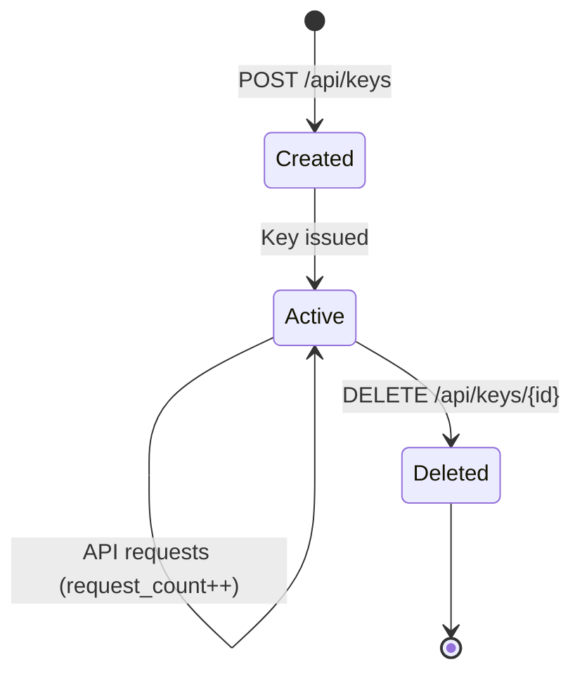

# Pastiche Security

## Authentication

Pastiche supports two authentication methods:

### 1. Cookie-based JWT (Web)
- GitHub OAuth flow via `/api/auth/github/login` and `/api/auth/github/callback`
- JWT stored in `access_token` HTTP-only cookie
- Used by the React frontend exclusively

### 2. Bearer API Key (CLI/Programmatic)
- Users create API keys via the web UI or `/api/keys/` endpoint
- Keys are prefixed (`pk_...`) for easy identification
- Key hash (SHA-256) stored in database — raw key shown only at creation time
- Passed as `Authorization: Bearer ...` header
- Request count and last-used timestamp tracked per key

## API Key Lifecycle

## CLI Security Considerations

### Config File
- Stored at `~/.pastiche/config.toml` with `0600` permissions
- Parent directory `~/.pastiche/` is created with `0700` permissions
- Contains API key in plaintext — equivalent to a password
- Must not be committed to version control (add to `.gitignore`)

### Environment Variables
- `PASTICHE_API_KEY` — API key (higher priority than config file)
- `PASTICHE_URL` — Server URL (higher priority than config file)
- Env vars are preferred in CI/CD and agent environments

### Priority Chain
1. CLI flags (`--api-key`, `--url`)
2. Environment variables (`PASTICHE_API_KEY`, `PASTICHE_URL`)
3. Config file (`~/.pastiche/config.toml`)

### Recommendations
- Use a dedicated API key per CLI installation/agent
- Rotate keys periodically — delete old, create new
- Never log the full API key except during key creation, when the API intentionally returns it once
- Normal key listing output shows prefix only
- Use HTTPS for all API communication
- Prefer HTTPS for remote servers and treat plaintext HTTP as development-only
- Prefer environment variables over config files in CI and autonomous agent environments

## Snippet Visibility

- `is_public: false` (default) — snippet only visible to authenticated owner
- `is_public: true` — snippet accessible via `/s/{short_code}` without auth
- Public snippets render as markdown when content type is markdown
- Toggle visibility via `PATCH /api/snippets/{id}/visibility`
