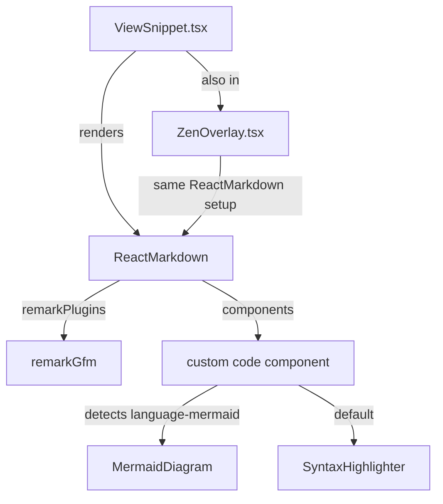

# Plan: Fix markdown preview list rendering + add mermaid support

> **For Hermes:** Use subagent-driven-development skill to implement this plan task-by-task.

## Context

Markdown preview in Pastiche's snippet view has two issues:
1. **Lists don't render bullets/numbers** — `<ul>` and `<ol>` items appear as plain text without `•` or `1.` prefixes
2. **No mermaid diagram support** — GitHub-style ` ```mermaid ` code blocks aren't rendered as diagrams

### Root cause (lists)

Tailwind CSS v4's preflight layer resets `list-style: none` on all `ul`/`ol` elements globally. The `.markdown-preview` CSS in `index.css` sets `padding-left: 1.6em` and `margin` but never restores `list-style-type`. The `<li>` elements render but without markers.

### Architecture



**Two files use ReactMarkdown** — `ViewSnippet.tsx` (line 480) and `ZenOverlay.tsx` (line 197). Both need identical changes.

---

## Task 1: Fix list styling in CSS

**File:** `frontend/src/index.css`

**Change:** Add `list-style-type` to existing `.markdown-preview ul` and `.markdown-preview ol` rules.

```css
/* BEFORE (line 335-338) */
.markdown-preview ul,
.markdown-preview ol {
  padding-left: 1.6em;
  margin: 0.75em 0;
}

/* AFTER */
.markdown-preview ul {
  list-style-type: disc;
  padding-left: 1.6em;
  margin: 0.75em 0;
}

.markdown-preview ol {
  list-style-type: decimal;
  padding-left: 1.6em;
  margin: 0.75em 0;
}
```

**Why separate rules:** `list-style-type` needs different values for `ul` (disc) vs `ol` (decimal). Nested lists inherit correctly with separate selectors.

**Verification:** Open any snippet with list content in preview mode. Bullets and numbers should be visible.

---

## Task 2: Install mermaid dependencies

**Commands:**
```bash
cd /home/jeff/devel/jeffreyvdb/pastiche/frontend
pnpm add react-markdown-mermaid mermaid
```

**Packages:**
- `react-markdown-mermaid` — rehype plugin + MermaidBlock component for ReactMarkdown v10
- `mermaid` — core rendering engine (peer dep of react-markdown-mermaid)

---

## Task 3: Create MarkdownCode component

**New file:** `frontend/src/components/ui/MarkdownCode.tsx`

A custom `code` component for ReactMarkdown that:
- Detects mermaid code blocks (className contains `language-mermaid`)
- Renders `<MermaidBlock>` from react-markdown-mermaid for mermaid blocks
- Renders `<SyntaxHighlighter>` for other code blocks (reusing existing highlighter)
- Falls back to plain `<pre><code>` if neither applies

```tsx
// Pseudocode outline
import { MermaidBlock } from "react-markdown-mermaid";
import SyntaxHighlighter from "react-syntax-highlighter";

const mermaidConfig = {
  theme: "dark",
  // Override accent to match Pastiche's --color-accent: #8ec07c
};

export function MarkdownCode({ className, children, ...props }) {
  const match = /language-(\w+)/.exec(className || "");

  if (match?.[1] === "mermaid") {
    const code = String(children).replace(/\n$/, "");
    return (
      <MermaidBlock
        code={code}
        mermaidConfig={mermaidConfig}
        onError={(err) => console.warn("Mermaid render error:", err)}
      />
    );
  }

  // existing SyntaxHighlighter logic for non-mermaid code blocks
  // ...
}
```

**Design decisions:**
- Mermaid config uses `theme: "dark"` to match Pastiche's dark UI
- No custom accent override — mermaid's dark theme is close enough, and accent overrides add complexity
- Error handling: show loading/error states from MermaidBlock (built-in), log errors to console
- Inline style: no separate CSS file import needed — react-markdown-mermaid's built-in styles handle layout

---

## Task 4: Integrate into ViewSnippet.tsx

**File:** `frontend/src/pages/ViewSnippet.tsx`

**Changes:**
1. Import `MarkdownCode` component
2. Add `components={{ code: MarkdownCode }}` prop to ReactMarkdown on line 480

```tsx
// Line 480 — BEFORE
<ReactMarkdown remarkPlugins={[remarkGfm]}>

// Line 480 — AFTER
<ReactMarkdown remarkPlugins={[remarkGfm]} components={{ code: MarkdownCode }}>
```

---

## Task 5: Integrate into ZenOverlay.tsx

**File:** `frontend/src/components/ui/ZenOverlay.tsx`

Same change as Task 4 — add `components={{ code: MarkdownCode }}` to ReactMarkdown on line 197.

---

## Task 6: Add mermaid container CSS

**File:** `frontend/src/index.css`

Add styles for mermaid blocks within markdown preview:

```css
.markdown-preview .mermaid-block {
  display: flex;
  justify-content: center;
  margin: 1.25em 0;
  padding: 16px;
  background: var(--color-surface);
  border: 1px solid var(--color-border);
  border-radius: 10px;
  overflow-x: auto;
}

.markdown-preview .mermaid-block svg {
  max-width: 100%;
  height: auto;
}
```

---

## Task 7: Verify with agent-browser

**Steps:**
1. Start the Pastiche frontend dev server
2. Open a snippet with:
   - Unordered list items (bullets should show `•`)
   - Ordered list items (should show `1.`, `2.`, etc.)
   - A mermaid code block (should render as diagram)
3. Verify in both normal view and zen overlay
4. Verify dark theme renders correctly on mermaid diagrams

---

## Files changed

| File | Change |
|------|--------|
| `frontend/package.json` | +2 deps (react-markdown-mermaid, mermaid) |
| `frontend/src/index.css` | Fix list-style-type rules, add mermaid CSS |
| `frontend/src/components/ui/MarkdownCode.tsx` | **New** — custom code component |
| `frontend/src/pages/ViewSnippet.tsx` | Import + wire MarkdownCode |
| `frontend/src/components/ui/ZenOverlay.tsx` | Import + wire MarkdownCode |

## Risks

- **Bundle size:** mermaid is ~1MB minified. Acceptable for a code snippet tool. No lazy loading needed — preview view already only renders on demand.
- **SSR:** Not applicable — Pastiche is a client-side SPA.
- **Mermaid version compatibility:** `react-markdown-mermaid` wraps mermaid internally. Pin versions in package.json if issues arise.
